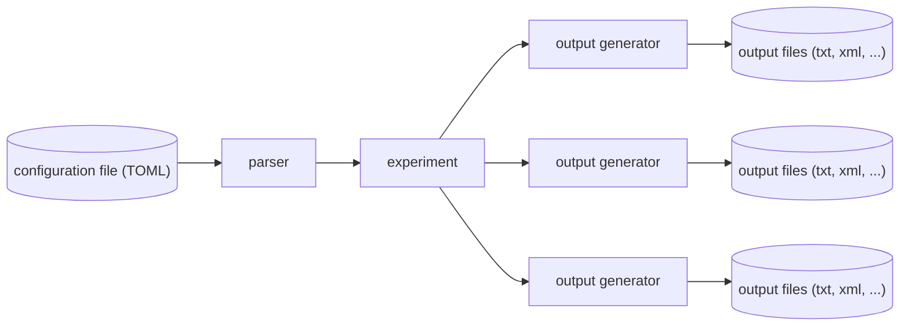

# Contributing

Thanks for your interest in collaborating to netlab. Please note that netlab is not actively maintained by the authors anymore as the bachelor intership is over. But feel free to create PRs!

## Prerequisites

### VS Code

We use Visual Studio Code with the [Go Extension](https://marketplace.visualstudio.com/items?itemName=golang.Go) installed.

For the most convenient development, turn on "Format On Save" in VS Code settings (`@lang:go @id:editor.formatOnSave`) and set the "Default Formatter" (`@lang:go @id:editor.defaultFormatter`) to `golang.go`.

### Pre-commit hook

Additionally you can use the provided **pre-commit hook** to run tests and format check on commit. Activate it by running the following command inside the repository:

```bash
git config core.hooksPath .githooks
```

Please make sure to use `gofmt` and `go test` (or use pre-commit hook instead) as tests will fail if your commits do not comply with the formatting style.

### golangci-lint

We also use the tool [golangci-lint](https://golangci-lint.run/) for some static code analysis. This is also part of our testing pipeline so please make sure to run those tests before commiting (or use pre-commit hook instead).

It can be installed as described [here](https://golangci-lint.run/usage/install/#local-installation). Please make sure it is callable by `golangci-lint` (e. g. by adding its path to the `$PATH` environment variable).

In case check errors should intentionally be ignored please use linter directives as described [here](https://golangci-lint.run/usage/false-positives/#nolint-directive).

## Structure

All functional code is inside the `internal` directory. It is split into these packages:

- `customtypes`: Package customtypes holds custom type definitions
- `eventgeneratortypes`: Package eventgeneratortypes holds all supported types of eventgenerator configurations such as MessageEventGenerator and MessageBurstGenerator.
- `experiment`: Package experiment holds the data structure needed to represent a experiment.
- `folderstructure`: Package folderstructure provides functions for the folder strucure of output data.
- `logging`: Package logging provides functions for logging.
- `movementpatterns`: Package movementpatterns holds all supported types of movement configurations such as RandomWaypoint, SLAW and SWIM.
- `networktypes`: Package networktypes holds all supported types of network configurations such as Wireless LAN and Switch.
- `outputgenerators`: Package outputgenerators holds generators for all supported output formats.
- `parser`: Package parser holds all functionality around parsing of the input TOML file.

## Information flow

The general flow of information can be visualized as follows:



The TOML file will be parsed by the `parser` package, which will generate an `experiment.Experiment`. This includes all information such as general experiment info, the networks, node groups and event generators. Then, the output generators (such as `outputgenerator.Core`, `outputgenerator.TheOne`) take this `experiment.Experiment` as their only parameter and generate all files depending on this configuration.

## Adding new output generators

As described above, output generators get an instance of `experiment.Experiment` passed as their only parameter to the `Generate` method. From there on, they should generate the respective configuration files with the information given in the `experiment.Experiment`, call the program with the repective parameters or similar.

If you're adding an output generator for a new software, you might also want to add a `experiment.Target`. Targets are the target softwares, a user might want configuration files for (e.g. `BonnMotion` is not a target as a user wants the configuration for network simulation softwares, not single movement patterns. But it is indeed an output generator). Targets can be added in the `experiment.Target` struct in `experiment/targets.go`.

For new output generators/targets to work properly, they must also be added to those locations:

- `cmd/generate.go`: `stringTargetMapping`
- `cmd/generate.go`: `targetOutputGeneratorMapping`
- `internal/parser/experiment.go`: `parseTargets`

## Logging

We use [slog](https://github.com/gookit/slog) as logger. It should be properly initialized when you're adding code that is called by the `generate` command. Thus, you can simply import the logger like so:

```go
import (
    logger "github.com/gookit/slog"
)
```

If it isn't initialized, you can run this code by yourself:

```go
import (
    "github.com/stg-tud/bp2022_netlab/internal/logging"
)

# First parameter defines, whether log level should be lowered to debug
logging.Init(false)
```

## Parser

The parser uses a custom mechanism to apply default values and check for required fields. The generic function `fillDefaults[IN any, OUT any](input IN) (OUT, error)` converts a struct `input` of the type `IN` to a struct of the type `OUT`. In doing so, only fields appearing in the `OUT` struct are considered. Struct fields in `IN` that have the type `any` allow for struct tags `default` and `required`. For example you could apply default values and check for required fields like so:

```go
type myInputStruct struct {
    MyRequiredField any `required:"true"`
    MyOptionalField any `default:"42"`

    MyNormalField string
}

type myTargetStruct struct {
    MyRequiredField bool
    MyOptionalField int

    MyNormalField string
}

# ...
inputData := myInputStruct{
    MyRequiredField: true,
    MyNormalField: "foo",
}

output, err := fillDefaults[myInputStruct, myTargetStruct](inputData)

# output will result in:
myTargetStruct{
    MyRequiredField: true,
    MyOptionalField: 42,
    MyNormalField: "foo",
}
```

Please note that this conversion and applying of default values only works for `int`, `int32`, `int64`, `uint`, `uint32`, `uint64`, `float32`, `float64`, `bool` and `string`.
